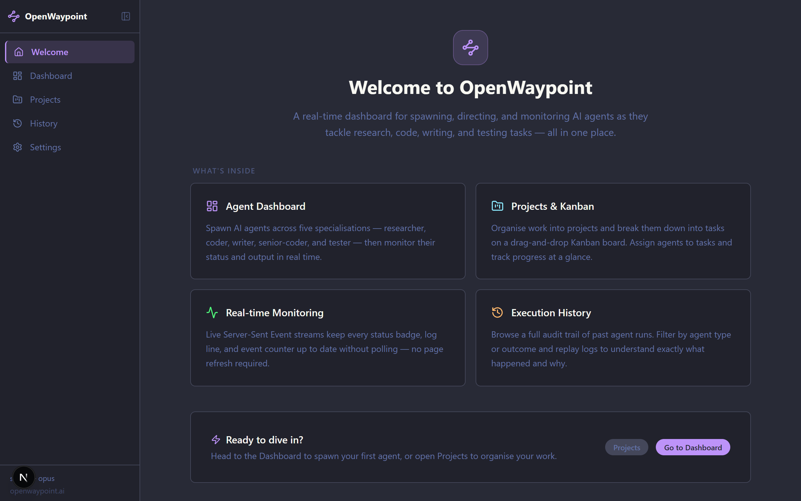
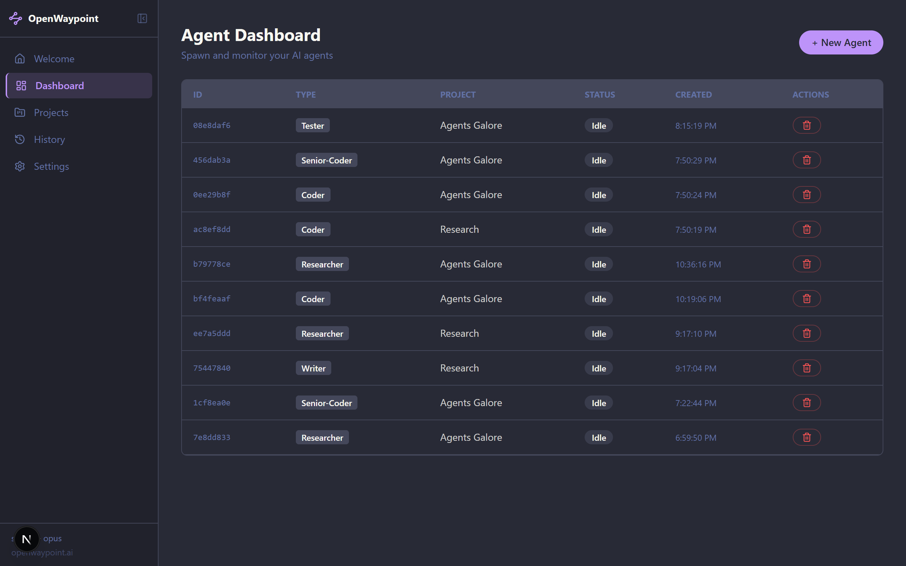
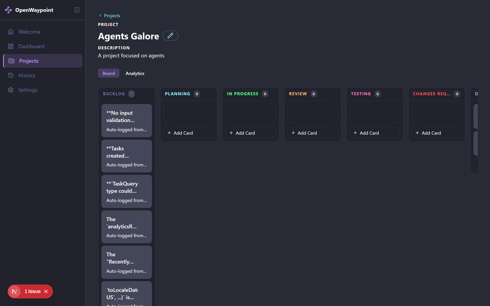
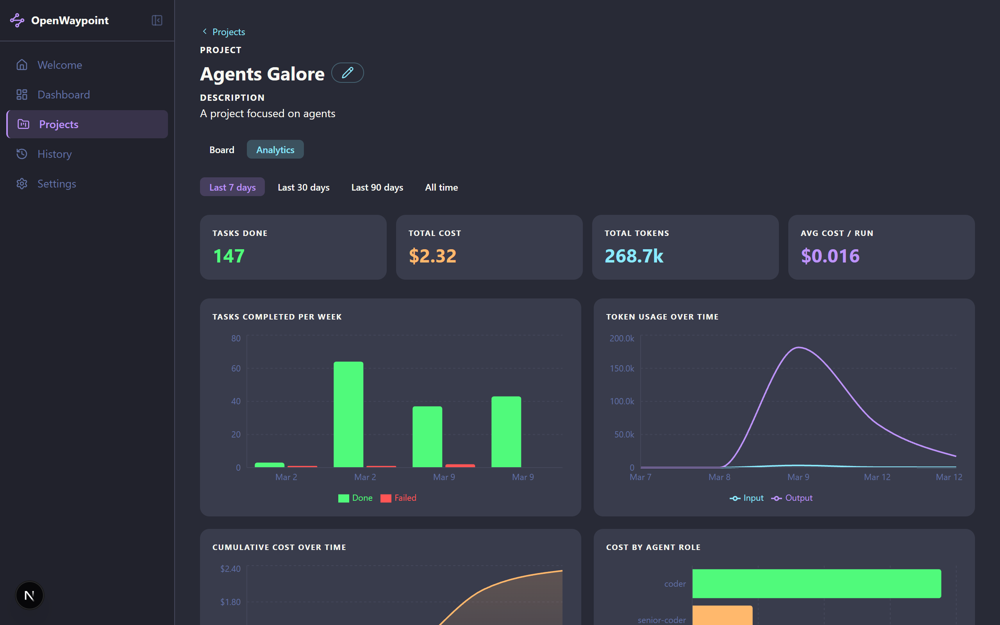
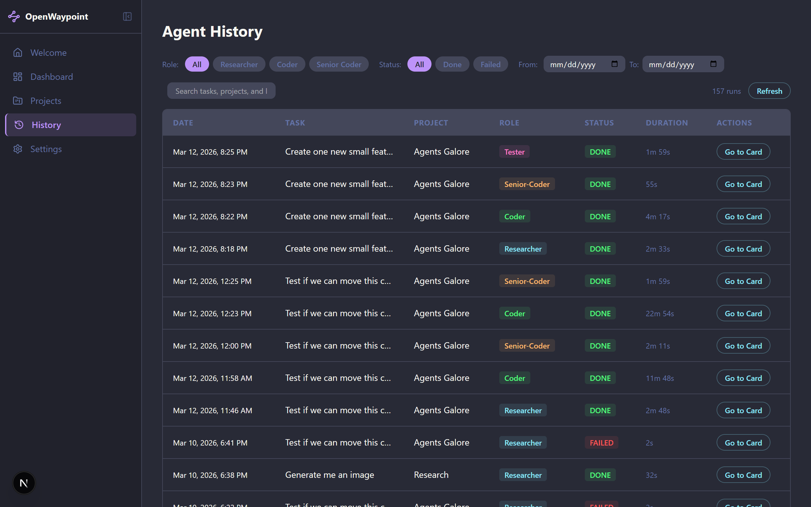
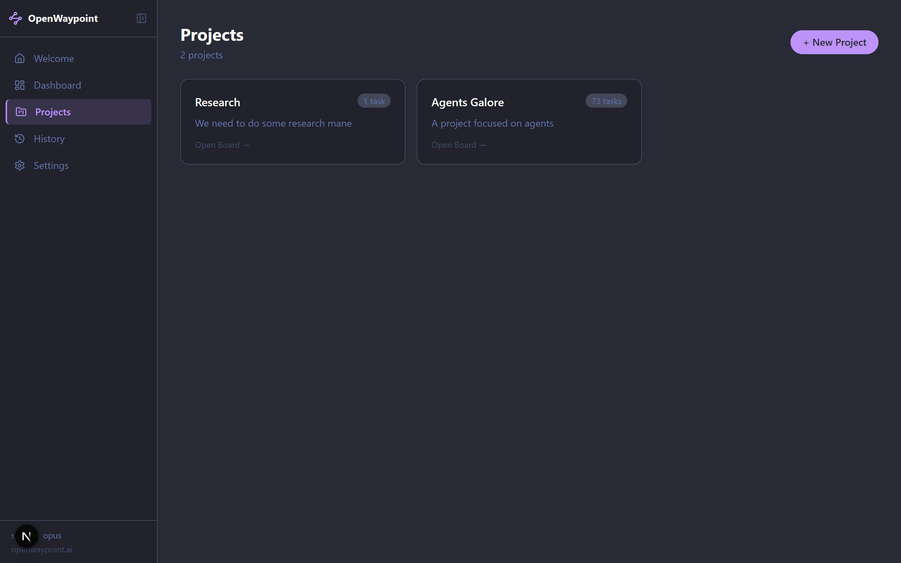
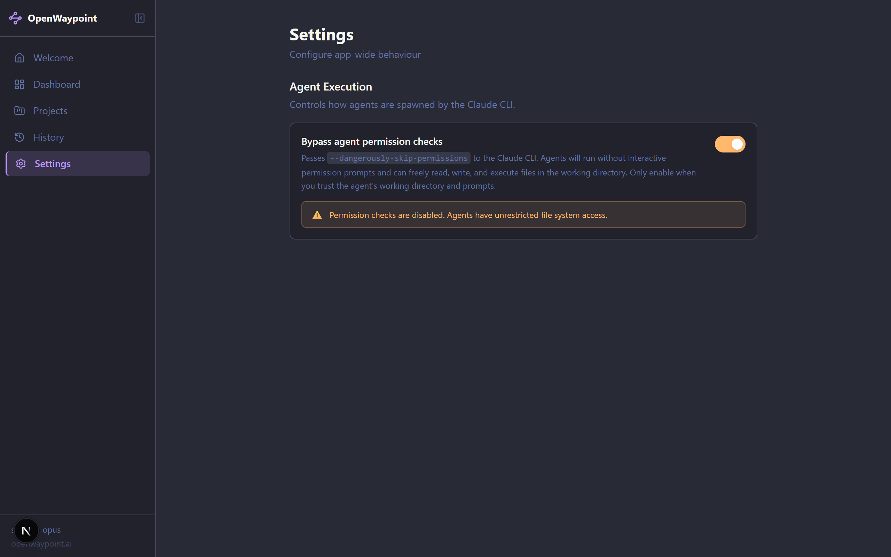

# OpenWaypoint

> A real-time dashboard for spawning, directing, and monitoring AI agents as they tackle research, code, writing, and testing tasks — all in one place.

Built with **Next.js 15 App Router**, **SQLite + Drizzle ORM**, **Server-Sent Events**, and the **Claude CLI**.

---

## Overview



OpenWaypoint gives you a Kanban-style project board where AI agents move cards through columns automatically. Spawn a researcher, hand its output to a coder, let a senior coder review it, and finally have a tester write and run test cases — all without manual hand-offs.

---

## Features

### Agent Dashboard

Spawn and monitor agents across five specialisations — **researcher**, **coder**, **senior-coder**, **tester**, and **writer** — with live status, token counts, cost, and duration tracked per run.



### Projects & Kanban Board

Organise work into projects. Each project gets a Kanban board (Backlog → Planning → In Progress → Testing → Done). Cards move automatically as agents complete pipeline stages, and the active pipeline stage is visualised on each card in real time.



### Project Analytics

Switch any project to **Analytics** view for a time-range breakdown of tasks completed, token usage, cumulative cost, and cost by agent role — all backed by Recharts and a fast SQLite aggregation query.



### Agent History

Full run history across all projects with filtering by role, status, and date range. 157 runs and counting.



### Projects List



### Settings

Toggle `--dangerously-skip-permissions` for the Claude CLI on a per-instance basis directly from the UI — no config file edits needed.



---

## Agent Pipeline (Coding Boards)

```
researcher  →  coder  →  senior-coder  →  tester
    ↑                          |
    └──── review cycle ────────┘  (up to 2×)
```

1. **Researcher** gathers context and produces a research summary
2. **Coder** implements based on the summary
3. **Senior-Coder** reviews — emits `VERDICT: APPROVED` or `VERDICT: NEEDS_REVISION`
4. **Tester** writes test files, runs the project's test runner, and emits `VERDICT: TESTS PASSED` or `VERDICT: TESTS FAILED`
5. On failure the coder retries (max 2 cycles), then the task is marked done

---

## Tech Stack

| Layer | Choice |
|---|---|
| Framework | Next.js 15 (App Router) |
| Database | SQLite via Drizzle ORM |
| Real-time | Server-Sent Events (`/api/stream`) |
| AI backend | Claude CLI (`claude` binary) |
| Styling | Tailwind CSS + Dracula theme |
| Charts | Recharts |
| Tests | Vitest (unit + integration, 100+ tests) |
| CI | GitHub Actions (ubuntu-latest, Node 22) |

---

## Getting Started

### Prerequisites

- Node.js 22+
- [Claude CLI](https://docs.anthropic.com/en/docs/claude-code) installed and authenticated

### Install & run

```bash
git clone https://github.com/JLRansom/openwaypoint.git
cd openwaypoint
npm install
npm run dev
```

Open [http://localhost:3000](http://localhost:3000).

### Database

The SQLite database is created automatically on first run at `data/openwaypoint.db`. Drizzle migrations run at startup — no manual steps needed.

---

## Development

```bash
npm run dev           # start dev server (localhost:3000)
npm run build         # production build
npm run lint          # ESLint check
npm run lint:fix      # ESLint auto-fix
npm run type-check    # tsc --noEmit
npm run test:run      # full test suite (Vitest)
npm run test:ui       # Vitest UI (browser)
npm run test:coverage # coverage report
```

### Architecture

See [`docs/architecture.md`](docs/architecture.md) for the full reference.

Key conventions:
- API routes live in `/app/api/[resource]/route.ts`
- In-memory singleton store in `/lib/store.ts` — import `getStore()` for all state access
- Agent simulation / Claude CLI integration in `/lib/agent-runner.ts`
- Real-time updates via SSE at `/app/api/stream/route.ts`
- Shared TypeScript types in `/lib/types.ts` — import from here, never redefine

### Worktree workflow

All code changes happen in a git worktree — never on `main` directly:

```bash
git worktree add .claude/worktrees/feat-my-thing feat/my-thing
# make changes, open PR, then clean up:
git worktree remove .claude/worktrees/feat-my-thing
```

---

## Project Structure

```
app/
  api/           Route handlers (agents, tasks, projects, files, stream…)
  dashboard/     Agent dashboard page
  projects/      Project list + project board + analytics
  history/       Run history page
  settings/      App settings page
components/      Pure UI components (no store access)
lib/
  db/            Drizzle schema, migrations, repositories
  executors/     Claude CLI executor abstraction
  services/      agentService — pipeline logic, prompt building
  types.ts       Shared TypeScript types
  constants.ts   Role colours, pricing, shared constants
docs/            Architecture + agent type reference
context/         Living project memory (roadmap, decisions, sprint)
__tests__/       Vitest unit + integration tests
```

---

## License

MIT
